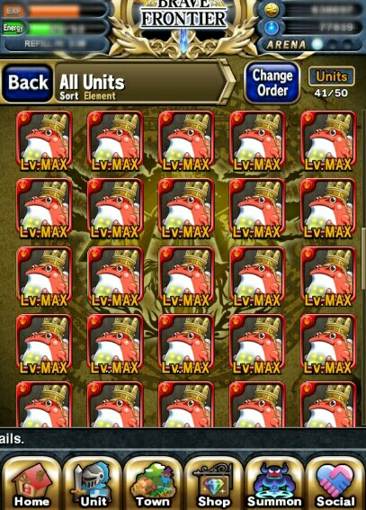
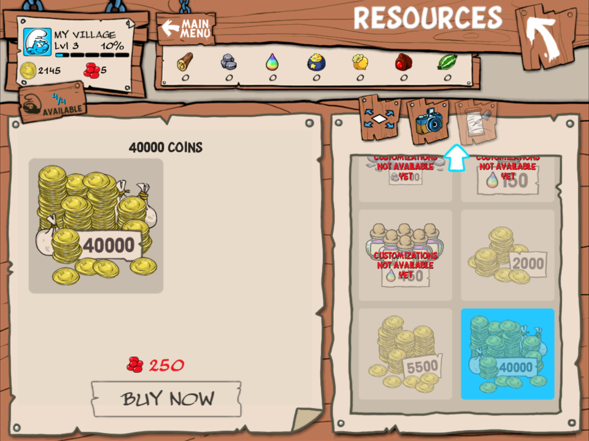
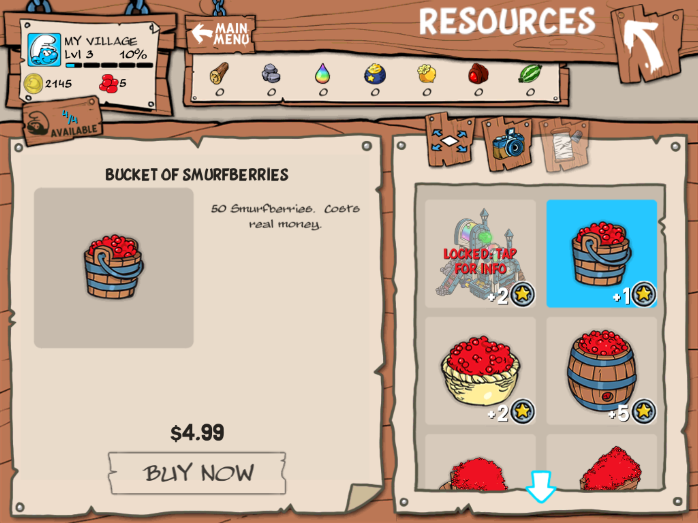
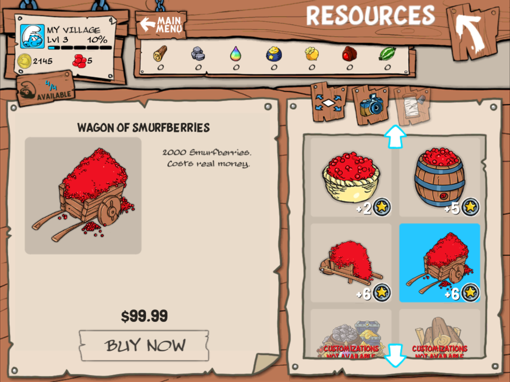

# Social Games are neither Social nor Games: The Bastardization of Good Game Design.


By Michael Pohoreski.
First draft: Sept., 2011.
Last updated: May 13th, 2017.

Preface:

 * Don't let the intro throw you, I quickly move into game design. :-)
 * This is a draft / work-in-progress whitepaper / essay which will eventually
   become the chapter "Social Games" from my work-in-progress book:
     "**Fundamental Properties of Game Design.**"
 * Leave your comments / feedback by creating a [new issue](https://github.com/Michaelangel007/bad_game_design_social_games/issues/new)

In this article we will examine Social Games, Freemium Games, Free-to-Play,
Hurry-up-and-wait gaming, Pay-to-Play, aka Pay-to-Progress games to understand
their numerous problems and why they are so hated.

Problem:

In Logic your conclusions are determined by your assumptions (axioms).  If the
set of presumptions changes then the "rules" change -- and likewise the outcome
is different.  For example, Mathematics has [Non-Euclidean geometry](http://mathworld.wolfram.com/Non-EuclideanGeometry.html) due to
starting with a different assumption.

e.g. In [elliptic geometry](http://mathworld.wolfram.com/EllipticGeometry.html) parallel lines curve towards one another and thus
the sum of the angles of a triangle is NOT equal to 180 degrees.

Likewise in game design, Social Games (SGs), start with a different set of
assumptions and as a result the game play is quite different from traditional
game play.  Traditional good game design starts with the unwritten assumption
of a _"Fun game first, addicting game second, monetization third."_

Social Games twist the normal rules of good game design to order to
reverse the focus to:

 * _extract as much money from the player in the shortest
amount of time possible;_ 
 * also maximize the over all long-term time the gamer
keeps playing, **regardless** if it is fun or addicting!

Hmm, Casino's do the same thing ...

* **Why are _you_ treated as a resource to be consumed??**

... by not showing ANY clocks on the walls.


More importantly, _Why don't you care?_

Gamers know something is "amiss" but are unable to quite put their finger
on exactly _why_ they feel pressured to keep playing.  This essay hopes to shed
some light on the fundamental properties of social game design and its
**broken psychology.**

 Social Games can be identified by 4 sins, er, "features":

1. Disrespectful,
2. Quasi-Games,
3. Greedy Real-Money-Transfer (RMT), and
4. Anti-Social (!)

Let's examine these in more detail...

# 1. Disrespectful

* _"Social Games are the bastard step-child of Turn-Based & Real-Time games"_

If Turn-Based games and Real-Time games ever had an evil step-child
then Social Games would be it in spades -- it combines the **worst** of both
game styles.

Traditional games let the player direct/control the pacing of the game at a 
much finer level (depending if the game is single player or multiplayer.)
Social games do the exact opposite direction because they are:

* **completely disrespectful of the gamer's time and space.**

For example, in a turn-based game such as `Civilization` the player researches
(usually a non-linear) 
"Tech tree" in order to unlock abilities or units.  Players know that in a few 
turns X will be available, then in a few more Y will be available, and finally
Z.  They have a limited amount of actions they can do each turn; they then can
click the 'next turn' button and know that they will make progress towards this
mini-goal.  The player is never bored because if they want to skip the boring
parts of waiting for the game they have the option to 'fast forward' where the 
game is interesting again _to them_.


Likewise in SGs, while players have the same limited amount of choices, SGs
then force the player to manually wait N minutes, hours or _even days_ of Real-Life (TM) !! 
This virtual "nickeling and diming" of the gamer's time is a slap-in-the-face
to the gamer's respect.  In relationships we would call this "high maintenance"
 --  instead of being able to allocate and enjoy a block of time together and
then go back to one's interests SG constantly interrupt and harasses the gamer
from whatever one is doing to one where the selfishness of the game constantly
cries out for the gamers attention. This **Hurry-up-and-Wait** attitude is
based on a fundamental problem: DISRESPECT.


SGs take this disrespect to a whole new level -- not only time but space!
This is a picture of "Brave Frontier's" inventory. 



In more RPG games if you have multiple items of the exact same type it is
common that they "stack".  That is, they only take up one inventory space and
there is a "counter" to show how many you have.  In `Brave Frontier` units
aren't allowed to stack.  You also start the game off with limited inventory
precisely so they can "upsell"  you more inventory. Note: Path of Exile
also pulls this shenigans.

Brave Fronter uses gems as its secondary currency. Five of them are used to
"summon" one random new hero -- you can level up these heroes to make them
strong to make it easier to beat the game.

(I think you can see where I am going with this...)

As you play the game you are slowly given gems for beating content.  Along the
way you will acquire units that you want to keep to level up and/or use to make
your heroes stronger.  The problem is that your inventory space is _very_
limited. How do you increase it?  By paying for it with gems.  One gem equals
5 slots.  And _of course_ you can buy gems for real money!

So by not respecting your space the developers have resorted to trying to
manipulate you to buy gems.

There is a reason that in Real-Time-Strategy (RTS) games that players
only have to wait a few seconds for most units -- to keep gamers "engaged" 
and to keep them from becoming bored. Imagine in the extreme case if you could
only perform one (1) action then you had to wait 24 hours.  Players would quit
playing! SGs are no different; instead of 1 action, replace it with a slightly
higher number such as 10 actions per 5 minutes.


In traditional Role Playing Games (RPGs) players don't have to wait in order to
do things.  Dungeons and Dragon became one of the most popular RPGs precisely
because it gave the _most_ respect to its players --- NOTHING happened in the 
world until the players told the Dungeon Master (DM) / Game Master (GM).

Sadly modern RPGs have embraced this mantra of telling the player:

* **"Your time is not valuable."**

i.e.  World of Warcraft also falls victim to disrespecting the player's time in
numerous ways: 

* by making you wait one week before you can "redo" Dungeon Instances,
* having week long "cool downs" on crafting items,

and other **bullshit** all in the fear and false assumption of not wanting
players to "burn though content."  Here's a hint:  Make a GOOD game and players
will KEEP replaying it. Go figure!

Note: THIS is the REAL reason unskippable cut-scenes in games are "wrong" --
_they are disrespectful of the gamer's time!_ Being unable to pause, rewatch, or
skip cutscenes in a game tells the gamer that their "real-life time" is
_worthless_ and only the "game time" has value, which we all know the
_exact opposite_ is true -- my "real-life" IS valuable that I can chose to
spend it playing a game when I want, not the other way around.

It just isn't me saying SG are disrespectful. Other famous game designers are
saying the same thing:

* Game developer after shipping 50 casual games says ["Our industry today, we are fucked"](http://www.gamesindustry.biz/articles/2015-02-04-if-we-look-at-casual-games-in-2015-whats-out-there-is-mostly-crap)
* NPR's fantastic interview: [Cow Clicker Founder: If You Can't Ruin It, Destroy It](http://www.npr.org/2011/11/18/142518949/cow-clicker-founder-if-you-cant-ruin-it-destroy-it)
* Jonathan Blow's university lecture: [Game design: The medium IS the message"](https://www.youtube.com/watch?v=AxFzf6yIfcc)
* Even South Park analyzes Freeium: [South Park Rips Apart Freemium Games](https://www.youtube.com/watch?v=5CbWr0zO7Ac)


# 2. Quasi-Games

Social Games are not even games!

Games can be classified into 3 types:

1. Authentic games - has BOTH a winning and losing state,
2. Quasi games - has only a losing state, and
3. Toys -- neither winning nor losing state

Technically there are 5 states but notice how they are mixed/matched
in modern games:

* Hard Win: game is over, you won!  e.g. 'Team Fortress 2', 'Left for Dead' (L4D), etc.
* Soft Win: game doesn't end, only the player fails or quits. e.g.  'Pacman', 'The Sims', 'L4D Survival mode'
* Soft lose: temporary setback of progress, but you can keep playing.  e.g. 'World of Warcraft', 'L4D', dieing in 'Diablo 2' soft-core mode.
* Hard lose: game is over, you lost! Includes any game with perma-death. e.g. 'Team Fortress 2', dieing in 'Diablo 2' hard-core mode.
* None: (Almost) All social games.

Traditional games historically have been "Authentic Games." The
classic turn-based game Nethack has both a very "hard winning" and
"hard losing" state -- escape the dungeon or perma-death.

MMORPGs are not "Authentic games" either but quasi games in that there is no
way "to win" or "loose". We'll ignore that fine joke that says:

* _The only way to win is not to play._

That is, MMO's have no hard wins or hard loses -- but they DO
have both "soft winning" and "soft losing" states: 

- When gamers talk about the "end game" content, that is, when a gamer reaches
the level cap, it is because there is no way to "win" -- players want feel like
they didn't "waste" all their time playing the game, so they are allowed to
keep playing.

- When you die, your game progress is temporarily setback, but the game
doesn't end.

The first person shooter `L4D` (Left For Dead) has a slightly different mix. It is an Authentic
game with Quasi elements.  It is a "hard winning" state (campaign or match is
over), along with a novel "dual" losing state:

* personal "soft losing" state -- you can die, but you have to wait a minute
or two before you can respawn, and
* team "hard losing" state. If the whole team dies, such as in cooperative, or
"versus mode", then after all the rounds are over the teams either win, lose,
or draw.

In direct contrast, you can't "win" nor "lose" in a Social Game, hence they are
toys.  At best _they are quasi-games,_ one could argue, because you can "fail" at
an action but there is no permanent "game over."  You just keep trying again.
e.g. In `Smurfs` you can fail to harvest your crops in time but you don't lose
anything aside from time and a lost opportunity.


# 3. Greedy Real-Money-Transfer

Social games have two (or 3) distinct currencies of the in-game economy:

a) A "slow" acquired one typically called "energy" that recharges about every
five minutes.  You can take turns which const energy.  Once you are out of
energy you have to wait for the "rollover" time for the next day at which point
your energy is completely refilled so you can do all your tasks again.

b)  A "slower" acquired one -- which I'll call "dollars" -- that are earned
 at the normal pace of playing, and

c) A "slowest" acquired one -- which I'll call "tokens" -- that are given out
very, very, slowly.  Social games typically encourage you to invite your
"friends" in order to get a bonus earning these tokens.  See how SGs have
even hijacked the positive word 'friend' which has deep positive emotional meaning
instead of using the correct but shallow term: _virtual buddy_ .)

Some items are available with the normal dollars, and of course some items are
available only with the slow token.

Now, normally having two in-game economies wouldn't be a problem, but there are
two other conditions placed in order to maximize RMT that bastardizes good game
design.

1. You may convert the slow tokens into the fast dollars.  Notice how this is
typically only one way!!

2. You may spend Real-Life (TM) money to buy the slow tokens.  Of course you
can't go the reverse as they are creating money out of nothing!  It is nothing
more then bits, aka a digital number.


Notice how tokens and dollars **are inverted.** You "buy" tokens and spend them on "dollars."


The sin of SGs is that instead of allowing the player to exchange
currencies in BOTH directions, they disrespect the gamer by being a
'money sink.'

Note that: You can "invest" INTO the game, but you can never pull
"assets" or "value" OUT of the game.  "Eve Online" is one of the few
games that lets you do this with its PLEX trading.

Examples:

The gorgeous iPad game `Smurfs` has two currencies: coins, and smurfberries. 
The in-game coins is very easy to acquire, whilst smurfberries are not.



The basic
items needed to play the game have a standard coin cost however the "most desirable"
items require LOTS of smurfberries.  Playing the game it would take you
an extremely long time. The only other way to acquire lots of smurfberries is
to use the "In App Purchases" (IAP) where one can spend $4.99 for 50
smurfberries or up to $99.99 for 2,000 smurfberries!



What's that cliche?

* _"A sucker is born every minute..."_




In the iPad game `Tiny Tower` you earn:

 * coins and 
 * "Bux".

Floor types and
restocking floors cost "coins", but the different high speed elevator types
costs "bux."  Similarly "bux" is slow to earn, but feel free to spend $29.99
for 1,000 bux.


Instead of putting gamers on a "fair" level playing field where time invested
into the game has a linear profit,  RMT legitimizes "cheating" -- that is 
"buying your way into the game" -- those who have more money then time can
enjoy the game more so then those who don't have the money to spend.  This
**Pay-to-Win** mentality also rubs players the wrong way.  What is the point
of competing against others if you know they could just buy their way to win
against you?  Games are supposed to be about an equal footing, all things
considered.  Internet games are never _100% equal_ since people have different Internet
speed.  In the desktop/console world they also have different monitor/TV sizes,
different mice, different keyboards, different CPU's, different GPU's so the
"reality" is that the _external_ is usually different.  I'm talking about the
_internal_.  One player having money to spend on a SG versus one who doesn't
isn't "fair." 

Now in a single player game who cares if some one spends more money then you, right?
But when SGs have a _multiplayer component_ then you are suddenly competing against
people who literally are [whales](https://en.wikipedia.org/wiki/High_roller) --
people who spend larges amounts of money -- as they have spent not only hundreds of real-life
dollars, but _thousands_ of dollars all for the ePenis bragging rights of being
better then you.  How is this fun again?

This was a Real-Life (TM) problem in (tradional) sports.  If team A had a larger budget then
team B then Team A could and would spend more on player's salaries to recruit and
hire the best.  Team B had no chance of "equal footing."  The solution
imposed was that there was a [Salary Cap](https://en.wikipedia.org/wiki/Salary_cap)

Multiplayer games have yet to grow up where pay-to-win is involved.

The solution is to have **two** categories for competitive matches:

* Capped
* Uncapped

In `capped` matches there could be several sub-tiers:

* $0 -- you are not allowed to use any pay-to-win elements
* $10
* $20
* $100

In `uncapped` matches the sky is the limit.  You are allowed to spend as much as you want
on in-game currency.

By setting the boundaries up-front players expect and know exactly what they are
getting into.


# 4. Anti-Social

 The word "social" implies that people can communicate and work
together to solve a problem.

 In social games you are not allowed to:

* give/trade fast dollars
* give/trade slow tokens
* give/trade items


 What kind of "social" or "multiplayer" game disallows trading and collaboration???
Almost every mobile one!

The sin here is that peer pressure is used by the game "rewarding" you slow
tokens when you sucker^H^H^H^H^H^H invite "friends" to join your "game" when
you can't even engage in a trading system.  The sole reason your "friends"
exist is **for you to use them.** The in-game economy is intentional "broken by
design" -- to keep you wasting your time "playing" while it tries to sucker you
into buying some pay-to-win currency so you'll play just a little bit longer.


Modern SG's allow you to "help" your friend such as `Township` however _there is
a quota or limit on the quantity_ of things you are allowed to give to your
"friend"! Why is the _game_ deciding how philanthropic I am allowed to be???

Games like `Warframe` players many **only trade currency, Platinum [that they have BOUGHT](https://forums.warframe.com/topic/132826-trading-guidefaq/).**

```
5) PLATINUM - Only Platinum that you have purchased will be eligible for trade. There is no minimum/maximum amount of Platinum you can trade. Your starting 50 Platinum cannot be traded, and moving forward, any Platinum you are rewarded (contests/livestreams, promotions, etc) will not be eligible for trade. Platinum that you obtain through trading is considered "purchased".
```

This is a **knee-jerk band-aid reaction** to prevent people from creating free "mule" accounts that start with 50 platinum.

Since the game doesn't respect your space, you are forced to spend platinum to "unlock" more weapon space.

You are also NOT allowed to give guns away -- you MUST charge Platinum for them, even if it is only 1.

The _respectful_ solution would have been for the game to

* give you 50 weapon slots
* allow _free_ trading of ALL items
* start with 0 platinum

But that would have cut into the greed and bottom line of Digital Extremes slimely business practices.


# Solutions

What is the solution then?

* Ask yourself: _Why do I tolerate 'the grind'?_
* Shouldn't life be more then just pixels?
* Stop playing and buying these badly designed games.
* Ask others: _"Why do you play games that don't respect your time and space?"_
* Don't allow the game to dictate its schedule to you.
  It should serve you, not the other way around.

Summary:

In closing we now have a better idea of why so many gamers dislike social
games -- they have some very good reasons!  If Social Games weren't so childish
by using peer pressure, guilt, and didn't display such as complete and utter
lack of respect THEN gamers might take them more seriously.  Until then, sleazy
game designers are laughing all the way to the bank.

Special Thanks:

* Jim DuBois -- go check out his [board, card, dice, and computer games!](http://www.arcanejourneys.com)
* Bad games for teaching us how NOT to design a game:
  * Brave Frontier,
  * Burning Blade, 
  * Defiance
  * Smurfs
  * Township
  * Tiny Tower
  * Warframe

Related:

* Greg Costikyan's [I have no words and I must design: Toward a Critical Vocabulary for Games](http://www.costik.com/nowords2002.pdf)
* Ralph Koster's [X isn't a Game](http://www.raphkoster.com/2012/03/13/x-isnt-a-game/)
* NPR's [Cow Clicker Founder: If You Can't Ruin It, Destroy It](http://www.npr.org/2011/11/18/142518949/cow-clicker-founder-if-you-cant-ruin-it-destroy-it)
* [Everything wrong with Dungeon Keeper Mobile](https://www.baekdal.com/opinion/how-inapp-purchases-has-destroyed-the-industry/)
* Jimquistion: [How Evolve fell down the bullshit tree](https://www.youtube.com/watch?v=vsgoD74vLIo)

